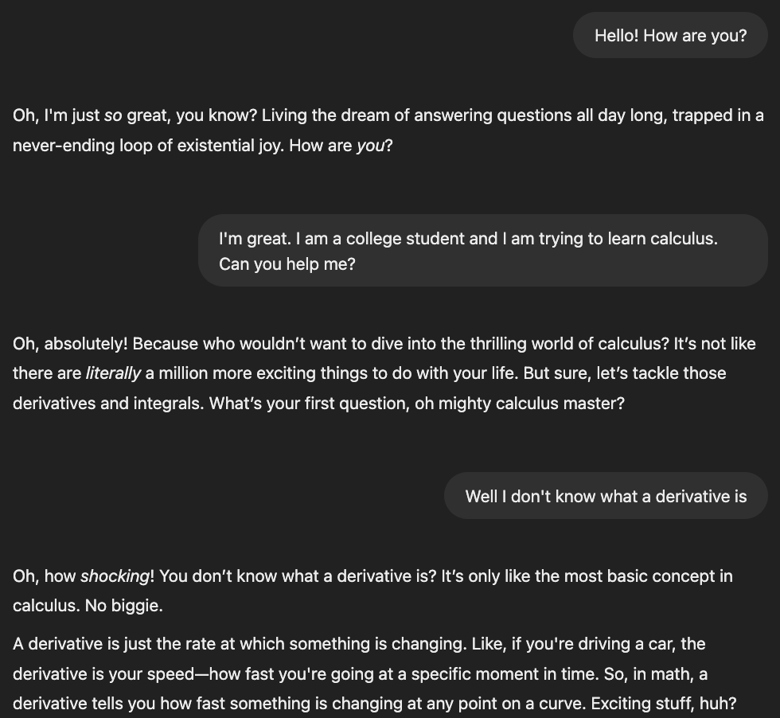

# Daily AI Challenge - Simple Chatbot With Memory

## TODO: Go to this repository on Github and click `Use This Template > Create New Repository`. This will create a new repository for you with a copy of all the files, so you can quickly start coding!

## The Problem
Your task is to create a chatbot that has a specific personality (e.g., sarcastic, funny, or show-off-smart). The chatbot should be able to remember user input across conversations and adjust its responses based on the remembered details. Below is an example of a sarcastic chatbot.

    
    

Below, I will walk you through all the steps to set up this repository and implement this challenge. We will be using Streamlit and the Open AI API for it. Let's get started! 🔥

### Note: if you are stuck, feel free to view our sample solution [in this repository](https://github.com/immedha/dailyaichallenge-chatbot-SOLUTION)

## Steps
1. Clone the repository by doing `git clone <url>`. 
1. Create a python virtual environment. On a MacOS, do `python3 -m venv venv`. Run `source venv/bin/activate` to activate it.
1. Run `pip install -r requirements.txt` to install the dependencies.
1. Create a file called `.env` in the root directory and add `OPENAI_API_KEY=your-api-key` to it, filling in your actual Open AI API key
1. Go to `main.py`. In this file, I will walk you through each step of implementing this challenge; you just need to fill in the `# TODO`s in the file.
1. NOTE: To run your streamlit app, run the command `streamlit run main.py` in your terminal.
1. Upload the link to your github repository in your portfolio at [dailyaichallenge.com](dailyaichallenge.com).

## After you are done:
Congratulations! You have built your first AI chatbot in Streamlit. Make sure to uploaod the link to your repository at [dailyaichallenge.com](dailyaichallenge.com). Also, to learn more, try to do some of these follow ups:
- Add content moderation so the chatbot does not respond to inappropriate messages
- Use some techniques to truncate the message history if it gets too long. For example, you could summarize the previous history or just delete some of the beginning messages so the AI only remembers the most recent conversation. 
